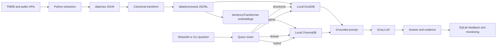

# Cultural Mood Tracker

Cultural Mood Tracker is an end-to-end LLM application for exploring how movies and television shows are described, rated, discussed, and received. A user can ask factual questions, request recommendations, compare titles, or ask why a title is attracting attention. The application routes each question through local SQL, retrieval-augmented generation (RAG), or a hybrid of both.

The problem it solves is fragmentation: structured facts such as ratings and attention signals live separately from descriptions, reviews, and editorial coverage. The application combines both forms of evidence into one conversational interface while showing the SQL and retrieved chunks used for an answer.

All scraped and transformed data is stored locally. No hosted database is required.

## What you can ask

- “What is the rating for Disclosure Day?” — local DuckDB
- “What happens in Project Hail Mary?” — Chroma vector retrieval + LLM
- “Why is Obsession popular?” — DuckDB analytics + retrieved text + LLM
- “Compare Disclosure Day and Project Hail Mary.” — hybrid comparison
- “Recommend a thoughtful science-fiction drama.” — SQL-ranked candidates with review evidence

## Architecture



### Technology choices

- **DuckDB** stores and queries structured facts locally in one portable file.
- **ChromaDB** stores the local vector index.
- **BAAI/bge-small-en-v1.5** creates document and query embeddings.
- **Groq** provides hosted LLM inference; only `GROQ_API_KEY` is required to generate answers.
- **Streamlit** provides the chat interface and monitoring dashboard.
- **SQLite** stores interactions and user feedback locally.

## Data

The full extraction pipeline downloads data from TMDB, IMDb public datasets, TVMaze, Wikidata, Wikipedia Pageviews, Guardian Open Platform, and optional curated critic feeds. Generated files are written under `data/raw/<source>/<run_id>/`; canonical tables are written under `data/processed/<process_run_id>/`.

For reproducible review, the repository includes a deterministic sample-data generator with eight fictional or upcoming-title records. Reviewers do not need data-service credentials to build the local DuckDB and Chroma stores. The sample corpus is intentionally small and is for verifying the complete application flow, not for judging production-scale recommendation quality.

The course FAQ corpus is not used.

## Quick start: local sample

Python 3.12 is recommended.

```powershell
git clone https://github.com/harshitm1297/LLM_Zoomcamp.git
cd LLM_Zoomcamp\final-project
python -m venv .venv
.\.venv\Scripts\Activate.ps1
python -m pip install -r requirements.txt
Copy-Item .env.example .env
```

Set a Groq key in `.env`:

```env
GROQ_API_KEY=your-groq-api-key
```

Prepare DuckDB and Chroma from the included sample generator:

```powershell
python scripts\bootstrap.py --sample
```

Start the application:

```powershell
streamlit run app.py
```

Open `http://localhost:8501`. The monitoring page is available from the Streamlit page navigation or as a standalone process:

```powershell
streamlit run pages\1_Monitoring.py --server.port 8502
```

Open `http://localhost:8502` for the standalone monitoring view.

## Quick start: Docker Compose

Create `.env` and set `GROQ_API_KEY`, then run the one-shot local ingestion service before starting the UI services:

```powershell
docker compose --profile tools run --rm ingest
docker compose up --build
```

- Chat application: `http://localhost:8501`
- Monitoring dashboard: `http://localhost:8502`

The Compose stack uses Docker-managed local volumes for `data/`, `chroma_db/`, and the reusable model cache. This keeps the non-root container portable across Windows, macOS, and Linux. No external database container or account is needed.

## Full local data pipeline

To download and transform the real multi-source corpus, configure at least `TMDB_API_KEY` in `.env`, then run:

```powershell
python scripts\run_pipeline.py --movie-count 100 --tv-count 100
```

This command:

1. downloads aligned source data to `data/raw/`;
2. transforms it into canonical JSONL tables in `data/processed/`;
3. loads all available tables into `data/warehouse/cultural_mood_tracker.duckdb`.

Create the vector index for the returned process run:

```powershell
python scripts\embed_document_chunks.py --process-run-id <process_run_id>
python scripts\ingest_chroma.py --input-path data\processed\<process_run_id>\document_chunk_embeddings.jsonl
```

Alternatively, run `python scripts\bootstrap.py` to execute extraction, transformation, local SQL loading, embedding, and Chroma ingestion in one command.

## Configuration

| Variable | Required | Default | Purpose |
|---|---|---|---|
| `GROQ_API_KEY` | For generated answers/evaluation | none | Hosted LLM access |
| `TMDB_API_KEY` | Only for full extraction | none | TMDB discovery and metadata |
| `GUARDIAN_API_KEY` | No | `test` | Guardian editorial search |
| `LOCAL_DATA_ROOT` | No | `data` | Root for raw, processed, reports and warehouse files |
| `LOCAL_DUCKDB_PATH` | No | `data/warehouse/cultural_mood_tracker.duckdb` | Structured local database |
| `PROCESS_RUN_ID` | No | newest valid run | Selects processed chunks |
| `DOCUMENT_CHUNKS_PATH` | No | auto-discovered | Explicit canonical chunk file |
| `RETRIEVAL_STRATEGY` | No | `vector` | `bm25`, `vector`, `vector_reranked`, or `hybrid` |
| `RETRIEVAL_TOP_K` | No | `5` | Context chunks returned |
| `RETRIEVAL_CANDIDATE_K` | No | `20` | Candidates before reranking/fusion |
| `ENABLE_QUERY_REWRITING` | No | `true` | Deterministic intent expansion |
| `PROMPT_VARIANT` | No | `strict` | Evaluated prompt configuration |
| `LLM_TEMPERATURE` | No | `0.2` | Production generation temperature |
| `OBSERVABILITY_DB_PATH` | No | `data/monitoring/observability.db` | Local monitoring store |

See `.env.example` for extraction-specific controls.

## Retrieval design and evaluation

The same `ApplicationRetriever` is used by the Streamlit application, retrieval CLI, prompt CLI, retrieval evaluation, and LLM evaluation. Four strategies were evaluated on the curated golden set in `data/eval/retrieval_golden_set.jsonl`:

| Approach | MRR | Recall@5 | Precision@5 |
|---|---:|---:|---:|
| BM25 | 0.400 | 0.400 | 0.083 |
| Vector | **0.556** | **0.600** | 0.120 |
| Vector + reranking | **0.556** | **0.600** | **0.150** |
| Hybrid vector + BM25 | **0.556** | **0.600** | 0.120 |

MRR is the declared selection metric. Vector, reranked vector, and hybrid tied; plain vector is used in production because it achieved the best MRR with the least ranking complexity. Hybrid search and reranking remain available and are evaluated explicitly.

Reproduce the report:

```powershell
python scripts\retrieval_eval.py --approaches bm25 vector vector_reranked hybrid --output-path data\eval\retrieval_evaluation.json
```

The committed raw report is `data/eval/retrieval_evaluation.json`.

## LLM evaluation

Six questions test answerable questions, fact coverage, grounding, and correct refusal. Two prompt configurations were compared using the same retriever and model:

| Prompt | Fact coverage | Grounding overlap | Refusal correctness | Composite |
|---|---:|---:|---:|---:|
| Baseline | 0.667 | 0.380 | 0.833 | 0.614 |
| Strict grounded prompt | **0.861** | **0.420** | 0.833 | **0.723** |

The strict prompt is the production configuration.

```powershell
python scripts\llm_eval.py --output-path data\eval\llm_evaluation.json
```

The committed report includes per-question answers and metrics. Because LLM outputs can vary, reruns may differ slightly.

## Monitoring and feedback

Every interaction records route, latency, success/failure, retrieved chunk IDs, mean similarity, model and timestamp in local SQLite. The chat UI provides thumbs-up/down feedback. The dashboard contains:

1. requests over time;
2. positive-feedback rate;
3. mean latency by route;
4. route distribution;
5. errors over time;
6. mean retrieval similarity by route;
7. recent interactions.

No prompt, answer, or feedback data is sent to a monitoring vendor.

## Other useful commands

```powershell
# Unified CLI chat
python scripts\chat.py

# Inspect retrieval using the production strategy
python scripts\retrieve.py --query "scientist alone in space" --top-k 5

# Build and inspect a grounded prompt
python scripts\build_prompt.py --query "What happens in Disclosure Day?"

# Run all tests
python -m unittest discover -s tests -v
```

## Repository layout

```text
app.py                         Streamlit chat application
pages/1_Monitoring.py          Monitoring dashboard
scripts/                       User-facing command entry points
src/cultural_mood_tracker/
  chat/                        Routing, SQL, hybrid and answer orchestration
  evaluation/                  Final-answer evaluation
  extract/ and sources/        Local data download
  load/                        Local DuckDB materialization
  observability/               SQLite interactions and feedback
  pipeline/                    Full and sample bootstrap workflows
  rag/                         Embeddings, Chroma, retrieval and prompting
  transform/                   Canonical tables and analytics
data/eval/                     Golden sets and committed evaluation reports
tests/                         Unit and local integration tests
Dockerfile                     Reproducible application image
docker-compose.yml             Ingestion, chat and monitoring services
```

## Evaluation-criteria map

| Criterion | Evidence |
|---|---|
| Problem description | README problem statement and use cases |
| Retrieval flow | `rag/retriever.py`, `chat/orchestrator.py`, Chroma + Groq |
| Retrieval evaluation | Four-strategy report in `data/eval/retrieval_evaluation.json` |
| LLM evaluation | Two-prompt report in `data/eval/llm_evaluation.json` |
| Interface | `app.py` and CLI chat |
| Ingestion | `scripts/run_pipeline.py` and `scripts/bootstrap.py` |
| Monitoring | SQLite feedback plus seven dashboard sections |
| Containerization | Full workflow in Docker Compose |
| Reproducibility | Generated sample corpus, pinned versions and quick starts |
| Best practices | Hybrid search, reranking and query rewriting |

## Limitations

- The included sample corpus is deliberately small; run the full extraction for meaningful breadth.
- Generated answers require a Groq API key and network access.
- The first embedding run downloads the public BGE model and is slower than subsequent runs.
- Automated metrics do not replace human review of factuality and recommendation quality.
