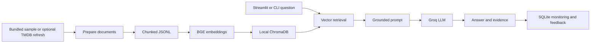
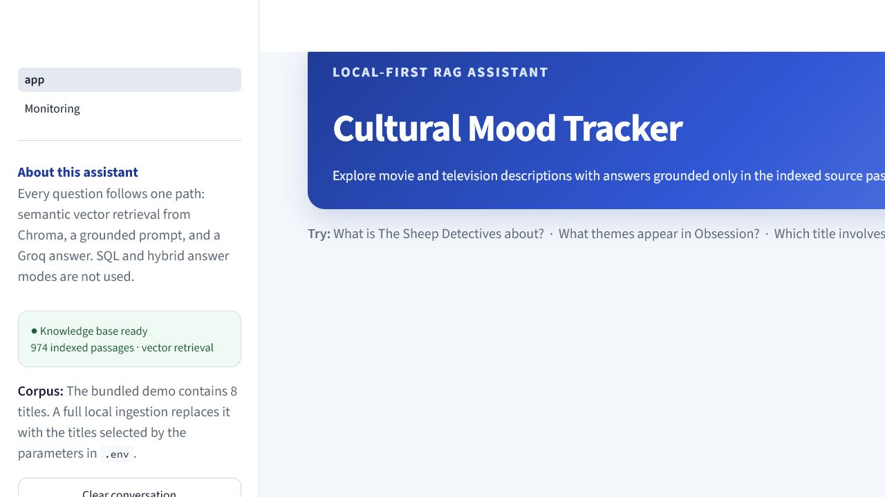
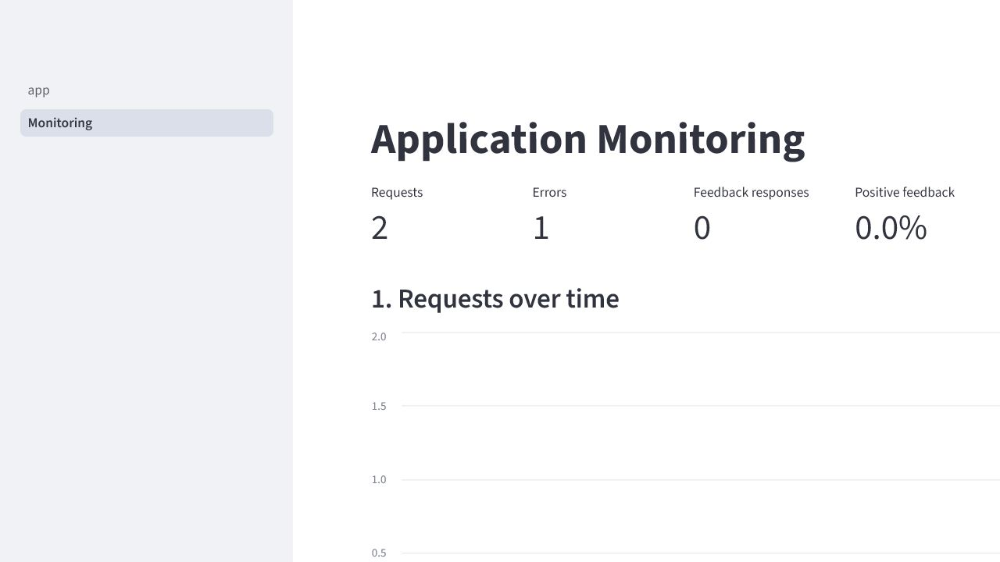

# Cultural Mood Tracker

Cultural Mood Tracker is a RAG chatbot for exploring movie and television descriptions. A question is embedded, matched against a local Chroma vector index, placed in a grounded prompt, and answered by a Groq-hosted LLM. Retrieved passages are shown with each answer so the user can inspect the evidence.

The production chatbot is deliberately RAG-only. It has no SQL mode, database agent, hybrid route, or recommendation router.

## Problem and users

Movie information is scattered across title pages and reviews. This project gives a viewer or researcher one conversational interface for asking what an indexed title is about, identifying themes, and comparing indexed descriptions. If the answer is absent from the retrieved text, the prompt instructs the model to say that context is insufficient.

Example questions:

- What happens in Project Hail Mary?
- What themes appear in Obsession?
- Which indexed title involves a scientist alone in space?
- Compare Disclosure Day and Project Hail Mary.

## Architecture



There is no analytics warehouse. The application stores only:

- prepared documents and chunks under `data/processed/`;
- embeddings and the Chroma vector index;
- evaluation reports;
- interaction and feedback records in local SQLite.

## Dataset and scraping

The reproducible demo corpus contains **8 titles: 6 movies and 2 TV series**. It creates **8 overview documents** and, with the current short passages, **8 chunks**. It is generated from version-controlled sample records; it is not scraped at startup.

An end user does **not** need to scrape data. The local sample, Docker ingestion service, and empty Render disk all use:

```powershell
python scripts\bootstrap.py --sample
```

Maintainers can optionally replace the sample index with current TMDB descriptions and user reviews:

```powershell
python scripts\refresh_data.py
```

That command uses `TMDB_API_KEY`, the configured date window, and the movie/TV sample sizes. It writes the downloaded content locally to `data/processed/<run-id>/` and rebuilds Chroma. The exact live-corpus count varies because some titles have no overview or reviews. The run manifest records the actual document and chunk counts.

The latest verified local refresh on **2026-07-21** used the checked `.env` limits and contains **200 titles (100 movies and 100 TV series), 705 documents, and 974 chunks**. Those documents comprise 200 overviews and 505 TMDB user reviews. It includes *The Sheep Detectives*. Live generated data is ignored by Git, so reviewers still receive the deterministic 8-title bootstrap unless a prepared dataset is published separately.

## Local quick start

Python 3.12 is recommended.

```powershell
git clone https://github.com/harshitm1297/LLM_Zoomcamp.git
cd LLM_Zoomcamp\final-project
python -m venv .venv
.\.venv\Scripts\Activate.ps1
python -m pip install -r requirements.txt
Copy-Item .env.example .env
```

Set your Groq key in the project-local `.env` file:

```env
GROQ_API_KEY=your-groq-api-key
```

Never commit `.env`; it is ignored by Git. Then build the sample index and start the UI:

```powershell
python scripts\bootstrap.py --sample
streamlit run app.py
```

Open `http://localhost:8501`. The app has a Monitoring page in Streamlit navigation. It can also run separately:

```powershell
streamlit run pages\1_Monitoring.py --server.port 8502
```

## Application preview

The chatbot home screen presents several possible applications: looking up a plot, exploring a title's themes, and finding an indexed title from a natural-language description:



The monitoring page reports request volume, feedback, latency, route usage, errors, retrieval similarity, and recent interactions:



## Docker Compose

Create `.env`, set `GROQ_API_KEY`, and run:

```powershell
docker compose --profile tools run --rm ingest
docker compose up --build
```

- Chat: `http://localhost:8501`
- Monitoring: `http://localhost:8502`

Docker-managed volumes retain `data/`, `chroma_db/`, and the downloaded embedding model. No external database account is required.

## Render cloud deployment

The repository root contains `render.yaml`, a deployment blueprint. This is deployment configuration; the repository alone does **not** prove that a live Render service has been created.

1. Push the repository to GitHub.
2. In Render, choose **New > Blueprint**.
3. Connect `harshitm1297/LLM_Zoomcamp` and select `render.yaml`.
4. Supply `GROQ_API_KEY` as a Render secret.
5. Create the Starter service and persistent disk.
6. Wait for `/_stcore/health` to pass, then record the generated public URL in this README.

On an empty persistent disk, `scripts/start_cloud.py` builds the sample vector index before starting Streamlit. Later restarts reuse it. The current submission should only claim cloud-deployment credit after the public URL has been tested from an unauthenticated browser.

## Configuration

| Variable | Required | Default | Purpose |
|---|---|---|---|
| `GROQ_API_KEY` | For generated answers and LLM evaluation | none | Groq inference credential |
| `TMDB_API_KEY` | Only for `refresh_data.py` | none | Optional TMDB refresh |
| `TMDB_START_DATE` / `TMDB_END_DATE` | No | see `.env.example` | TMDB discovery window |
| `TMDB_MOVIE_SAMPLE_SIZE` | No | `300` | Maximum discovered movies |
| `TMDB_TV_SAMPLE_SIZE` | No | `200` | Maximum discovered TV titles |
| `LOCAL_DATA_ROOT` | No | `data` | Prepared data, reports, and logs |
| `CHROMA_DB_PATH` | No | `chroma_db` | Persistent vector index |
| `PROCESS_RUN_ID` | No | newest valid run | Prepared chunk selection |
| `DOCUMENT_CHUNKS_PATH` | No | auto-discovered | Explicit chunk JSONL/CSV |
| `RETRIEVAL_TOP_K` | No | `5` | Retrieved context count |
| `ENABLE_QUERY_REWRITING` | No | `true` | Deterministic query expansion |
| `PROMPT_VARIANT` | No | `strict` | Evaluated prompt configuration |
| `LLM_TEMPERATURE` | No | `0.2` | Generation temperature |
| `OBSERVABILITY_DB_PATH` | No | `data/monitoring/observability.db` | Monitoring SQLite file |

`RETRIEVAL_STRATEGY` and `RETRIEVAL_CANDIDATE_K` remain available for offline retrieval experiments. The production chat orchestrator always requests vector retrieval.

## Retrieval evaluation

The Streamlit app, CLIs, and evaluations share `ApplicationRetriever`. The curated golden set is `data/eval/retrieval_golden_set.jsonl`.

| Approach | MRR | Recall@5 | Precision@5 |
|---|---:|---:|---:|
| BM25 | 0.400 | 0.400 | 0.083 |
| Vector | **0.556** | **0.600** | 0.120 |
| Vector + reranking | **0.556** | **0.600** | **0.150** |
| Hybrid vector + BM25 | **0.556** | **0.600** | 0.120 |

MRR is the selection metric. Vector, reranked vector, and hybrid tied, so production uses plain vector retrieval for the least complexity. BM25, hybrid, and reranking are evaluation alternatives, not chatbot modes.

```powershell
python scripts\retrieval_eval.py --approaches bm25 vector vector_reranked hybrid --output-path data\eval\retrieval_evaluation.json
```

## LLM evaluation

Six questions test coverage, grounding, and refusal. The committed report compares the baseline prompt and the production strict prompt.

| Prompt | Fact coverage | Grounding overlap | Refusal correctness | Composite |
|---|---:|---:|---:|---:|
| Baseline | 0.667 | 0.380 | 0.833 | 0.614 |
| Strict grounded prompt | **0.861** | **0.420** | 0.833 | **0.723** |

```powershell
python scripts\llm_eval.py --output-path data\eval\llm_evaluation.json
```

LLM outputs are nondeterministic, so reruns can differ slightly.

## Monitoring and feedback

Each request records latency, success or failure, retrieved chunk IDs, mean similarity, model, prompt variant, and timestamp. The UI accepts thumbs-up/down feedback. The dashboard shows request volume, feedback rate, latency, errors, retrieval similarity, and recent interactions. Prompt and answer data is not sent to a monitoring vendor.

## Useful commands

```powershell
# RAG-only terminal chat
python scripts\chat.py

# Inspect retrieval and prompts
python scripts\retrieve.py --query "scientist alone in space" --top-k 5
python scripts\build_prompt.py --query "What happens in Disclosure Day?"

# Rebuild an existing prepared run, replacing stale Chroma contents
python scripts\embed_document_chunks.py --process-run-id <run-id>
python scripts\ingest_chroma.py --replace --input-path data\processed\<run-id>\document_chunk_embeddings.jsonl

# Unit and integration tests
python -m unittest discover -s tests -v
```

## Repository layout

```text
app.py                         Streamlit RAG chat
pages/1_Monitoring.py          Monitoring dashboard
scripts/bootstrap.py           Reproducible sample ingestion
scripts/refresh_data.py        Optional TMDB ingestion
src/cultural_mood_tracker/
  chat/                        RAG answer orchestration
  evaluation/                  Answer evaluation
  observability/               SQLite interactions and feedback
  pipeline/                    Document preparation and bootstrap
  rag/                         Embeddings, Chroma, retrieval, prompts
  sources/tmdb.py              Optional TMDB client
data/eval/                     Golden sets and evaluation reports
tests/                         Automated tests
Dockerfile                     Reproducible image
docker-compose.yml             Ingestion, chat, monitoring
```

## Course evaluation-criteria map

| Criterion | Evidence |
|---|---|
| Problem description | Problem, users, and example questions above |
| Retrieval flow | `rag/retriever.py`, `chat/orchestrator.py`, Chroma, Groq |
| Retrieval evaluation | Four approaches, declared MRR metric, committed report |
| LLM evaluation | Two prompt variants and committed per-question report |
| Interface | Streamlit and terminal chat |
| Ingestion | Automated Python sample bootstrap and optional TMDB refresh |
| Monitoring | SQLite events, feedback, and dashboard |
| Containerization | Dockerfile and full Compose workflow |
| Reproducibility | Versioned sample, pinned dependencies, exact commands |
| Best practices | Query rewriting, evaluated alternatives, tests |
| Cloud deployment | Blueprint present; credit requires a verified public URL |

## Authorship and provenance

This project has a shared development history. Harshit Mangwani developed the original data foundation and the later local-first integration. Chiara Platichiara contributed to embedding, Chroma ingestion, and earlier chatbot orchestration. Paola Vasquez contributed to retrieval, prompt construction, and the earlier Streamlit interface. The complete contributor history is retained in the original `harshitm1297/pop-culture-detective` repository.

Creating a new repository or squashing commits does not transfer authorship. A course submission should disclose reused contributor work and must only claim personal credit for work the submitter actually created or substantially reworked.

## Limitations

- The reproducible sample is intentionally small: 8 titles and 8 passages.
- Generated answers require network access and a Groq API key.
- The first bootstrap downloads the public BGE embedding model.
- Optional TMDB refresh breadth depends on API results and configured dates.
- Automated evaluation complements, but does not replace, human factuality review.
